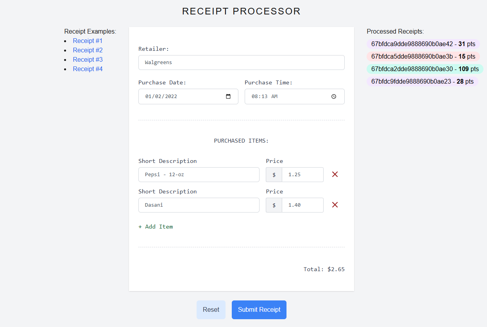

# Receipt Processor UI (Next.js)
This is a simple user interface (UI) developed using Next.js, primarily for demo purposes. It is designed to interact with backend services, which can be connected to one of the following repositories:
- https://github.com/sshushkevich/receipt-processor
- https://github.com/sshushkevich/receipt-processor-nestjs

This UI allows users to input receipt data and calculate the corresponding points automatically upon submission:

## Tech stack
- Next.js
- TypeScript

## Installation
TBD
